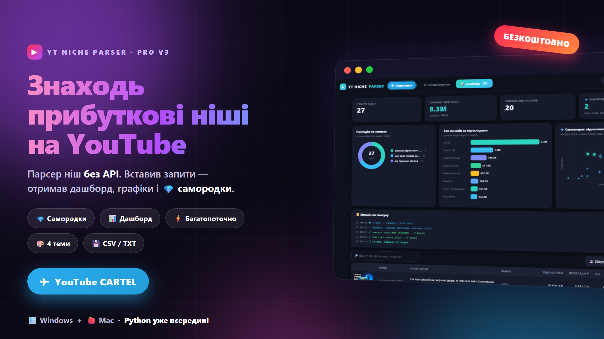
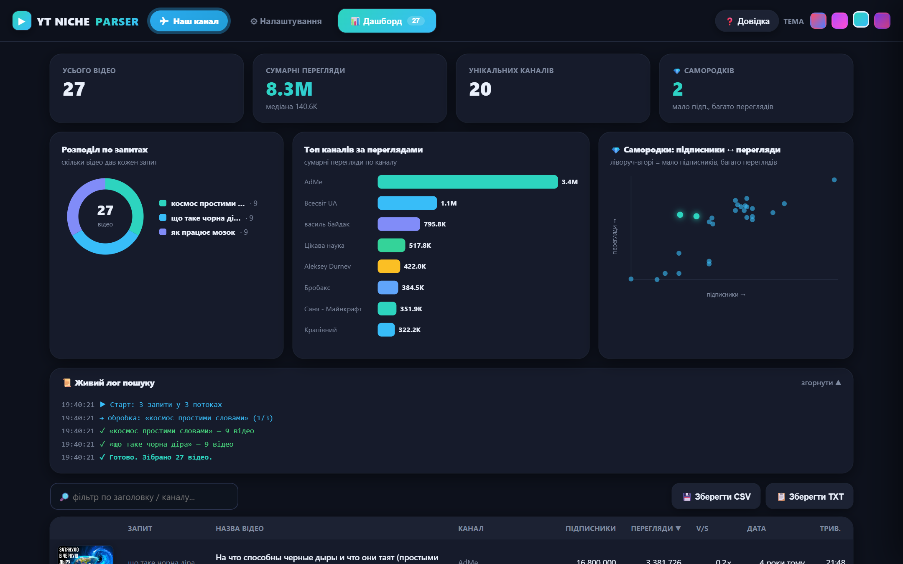

<p align="center">
  
</p>

<h1 align="center">YouTube Niche Parser Pro V3</h1>

<p align="center">
  Парсер ніш YouTube <b>без API</b>. Вставив запити — отримав дашборд:<br>
  перегляди · підписники · тривалість · графіки · 💎 самородки.
</p>

---

## 📥 Завантажити

| Система | Файл | Коротко |
|---|---|---|
| 🪟 **Windows** | **[⬇️ .zip](../../releases/latest/download/YouTube-Niche-Parser-Windows.zip)** | Розпакуй → `START.bat`. Python усередині. |
| 🍎 **Mac (готове)** | **[⬇️ .dmg](../../releases/latest/download/YouTube-Niche-Parser.dmg)** | Перетягни в Applications. Universal. |
| 🍎 **Mac (вихідники)** | **[⬇️ .zip](../../releases/latest/download/YouTube-Niche-Parser-Mac.zip)** | `START.command` або `build_mac.sh`. |

Нижче — **детальна інструкція для кожного варіанта** 👇

---

## 🪟 Windows — `YouTube-Niche-Parser-Windows.zip`

1. Завантаж архів і **розпакуй усю папку** (правий клік на zip → «Видобути все»).
   > ⚠️ Саме розпакуй, не запускай прямо з архіву.
2. Зайди в папку і двічі клікни **`START.bat`**.
3. Якщо вискочить синє вікно **«Захист Windows / Windows protected your PC»**:
   натисни **«Докладніше / More info»** → **«Виконати в будь-якому разі / Run anyway»**.
   (Це бо файл скачаний з інтернету — він безпечний.)
4. Відкриється вікно програми. Готово!

**Що потрібно:** нічого. Python уже всередині (папка `runtime\`), бібліотек нема,
Chrome не обов'язковий (підійде Edge — він є на кожному Windows).

---

## 🍎 Mac (готовий застосунок) — `YouTube-Niche-Parser.dmg`

1. Завантаж **`.dmg`** і відкрий його (подвійний клік).
2. У вікні, що з'явиться, **перетягни** `YouTube Niche Parser` у папку **Applications** (Програми).
3. Відкрий папку **Програми** і знайди там застосунок.
4. **⚠️ ПЕРШИЙ ЗАПУСК (важливо!):**
   правий клік (або Ctrl+клік) на застосунку → **«Відкрити»** → у вікні ще раз **«Відкрити»**.
   > Звичайний подвійний клік на першому запуску macOS заблокує — це нормально
   > для безкоштовних застосунків без платного підпису Apple ($99/рік).
   > Робиться це **лише один раз**, далі — звичайний подвійний клік.

### 🛠 Якщо пише «застосунок пошкоджено» / "...is damaged and can't be opened"

Це **не пошкодження** — це «карантин», який macOS чіпляє на все скачане з інтернету.
Лікується **одною командою** в Терміналі (Programs → Utilities → Terminal):

```bash
xattr -cr "/Applications/YouTube Niche Parser.app"
```

Натисни Enter, потім відкривай застосунок як зазвичай (правий клік → «Відкрити»).

### Альтернатива через налаштування

**System Settings → Privacy & Security** → прокрути вниз → біля заблокованого
застосунку натисни **«Open Anyway / Відкрити все одно»**.

> 🪟 **Вікно «як прога»** відкриється, якщо на Mac є **Chrome або Edge**.
> Якщо тільки Safari — відкриється як вкладка браузера (у Safari нема режиму вікна-додатка).
>
> 💻 Працює і на **Apple Silicon (M1/M2/M3...)**, і на **Intel** — застосунок universal.

---

## 🍎 Mac (вихідники + збірка) — `YouTube-Niche-Parser-Mac.zip`

Цей варіант — для тих, хто хоче запустити без `.dmg` або зібрати свій `.app`.

**Швидкий запуск (потрібен Python 3):**
1. Перевір у Терміналі: `python3 --version`. Якщо нема — постав: `brew install python`
   або з [python.org](https://www.python.org/downloads/).
2. Розпакуй папку, двічі клікни **`START.command`**.
   - Перший раз: правий клік → «Відкрити» → «Відкрити»
     (або раз у Терміналі: `chmod +x START.command`).

**Зібрати свій `.app` / `.dmg`:**
```bash
chmod +x build_mac.sh
./build_mac.sh
```
На виході: `dist/YouTube Niche Parser.app` + `YouTube Niche Parser.dmg`.

---

## ✨ Можливості

- 🎯 Фільтри ніші: макс. підписників, мін. переглядів, тип / тривалість / дата / характеристики
- 💎 **V/S** (перегляди ÷ підписники) — одразу видно самородки (малі канали з вірусними відео)
- 📊 Дашборд з графіками наживо + 📜 живий лог пошуку
- 🎨 4 теми оформлення · ⚡ багатопоточний пошук · 💾 експорт CSV / TXT

<p align="center"></p>

## 🔒 Як працює

НЕ використовує твій акаунт і НЕ лізе в браузер. Робить **анонімні** запити до YouTube
(як відвідувач в інкогніто) — без логіну, без кукі. Браузер потрібен лише щоб намалювати вікно.

## 🛠 Збірка macOS .dmg (для розробників)

Автоматична через **GitHub Actions** ([`.github/workflows/build-mac.yml`](.github/workflows/build-mac.yml)):
PyInstaller пакує застосунок + universal2 Python у `.app`, `hdiutil` робить `.dmg`, він публікується в Releases.
Перезібрати: вкладка **Actions → Build macOS .dmg → Run workflow**.

---

## 🔄 Оновлення

**14 червня 2026 — виправлення для macOS:**

- 💾 **Виправлено експорт CSV / TXT.** Раніше в режимі вікна-додатка (Chrome `--app`) збереження могло мовчки не спрацьовувати. Тепер файл надійно зберігається в папку **Завантаження** (`~/Downloads`) і програма показує точний шлях до нього (CSV — з BOM, щоб Excel коректно відкривав кирилицю).
- 🔒 **Виправлено помилку SSL-сертифікатів на macOS** (`CERTIFICATE_VERIFY_FAILED`). У зібраний `.app` тепер вкладається набір кореневих сертифікатів (`certifi`), тож пошук працює одразу «з коробки» — без окремого встановлення сертифікатів чи Python.
